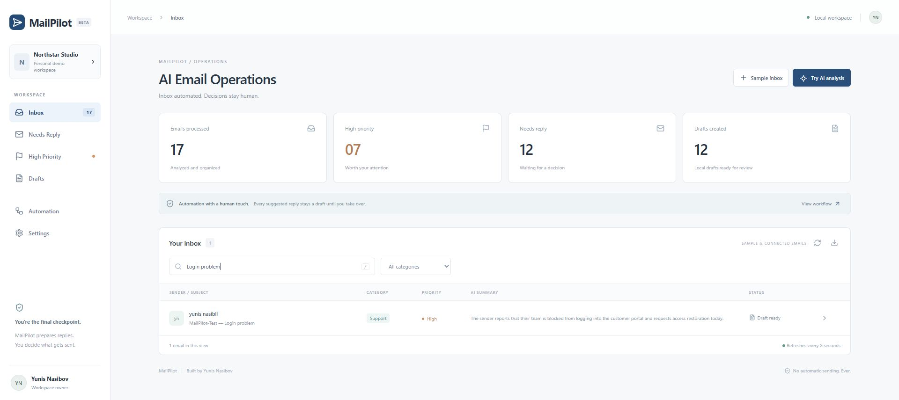
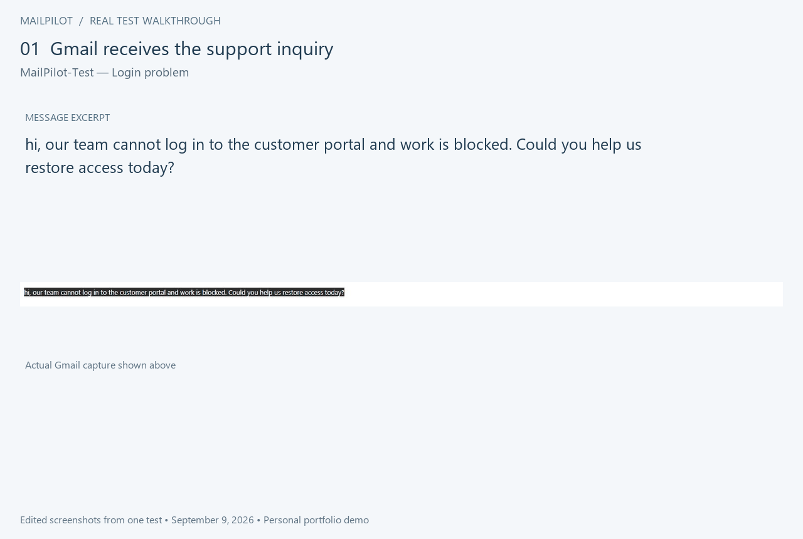

# MailPilot

AI Email Triage & Reply Assistant

**Hero demo: Login problem → Support / High → Gmail draft.** Captured from the real test run. Dashboard totals include sample emails; the filtered row is the connected Gmail test.

Email triage and editable reply drafts for a small business. React, FastAPI, Gemini and SQLite with an importable n8n Gmail workflow.

## How it works

Gmail → n8n → FastAPI → Gemini → SQLite → Gmail Draft → Human Review

A team reports that it cannot log in to its customer portal. MailPilot categorizes the inquiry as **Support / High**, saves the analysis and prepares a Gmail draft. A person reviews the reply before sending.

**28-second edited test walkthrough.** Screenshots show the same real test across Gmail, n8n and MailPilot; this is not a continuous live recording. No email was sent.

## Run locally

Create a Python virtual environment, install `requirements.txt`, then install frontend dependencies with pnpm and run `pnpm build` in `frontend`. Copy `.env.example` to `.env` and configure Gemini and a separate random intake token. Run `START.cmd` on Windows, or `python -m uvicorn backend.main:app --host 127.0.0.1 --port 4175`. Open http://127.0.0.1:4175.

The sample inbox contains 15 fictional emails with prewritten analyses. “Try AI analysis” calls Gemini with fictional content. These modes do not create Gmail drafts.

## Gmail workflow setup

Import `n8n/mailpilot-gmail.json` into local n8n. Connect the dedicated test Gmail credential to both Gmail nodes. Set an HTTP Header Auth credential on the three HTTP nodes: header `Authorization`, value `Bearer ` followed by the local `INTAKE_TOKEN`. Never commit credentials.

The trigger processes only inbox emails whose subject contains `MailPilot-Test`. It reads the body without downloading attachments. Gmail data matching this filter is passed to Gemini for analysis. Activate only after selecting the test account and reviewing its permissions.

Google OAuth requires a Google Cloud OAuth client and Gmail API access. Enter its client ID and secret in n8n, use the callback URI shown by n8n, and complete Google sign-in with the test account. Add that account as a test user if the OAuth app is in testing mode.

## Human review

No workflow node sends email. Approve Draft records local approval only. Local edits do not update a previously created Gmail draft; review and edit that draft in Gmail before manually sending it.

SQLite persists originals, analysis, revisions and activity. Duplicate message IDs reuse analysis. Gmail creation is reserved once; after an uncertain Gmail error, inspect Gmail drafts before manually resolving the reservation. Automatic retries must not create another draft.

## Verification status

Backend tests cover duplicate intake, draft reservations and receipts, stale edits, local approval, request boundaries and preserving failed analyses. The React production build passes. Real Gmail OAuth, trigger delivery, Gemini analysis and Gmail draft creation were verified on 2026-09-09. Google Sheets and notifications are not connected; SQLite is the implemented record store.

Hero demo verification (2026-09-09): the “MailPilot-Test — Login problem” inquiry automatically triggered n8n (execution 7), was classified **Support / High**, and produced a real Gmail draft without manual execution. Processing took about 16.5 seconds after detection; the polling interval is one minute. This is a test-account observation, not a client performance claim. Additional tests are documented in [VERIFICATION.md](docs/VERIFICATION.md).
